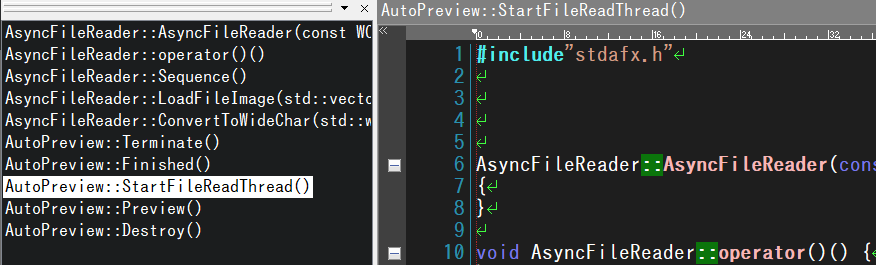
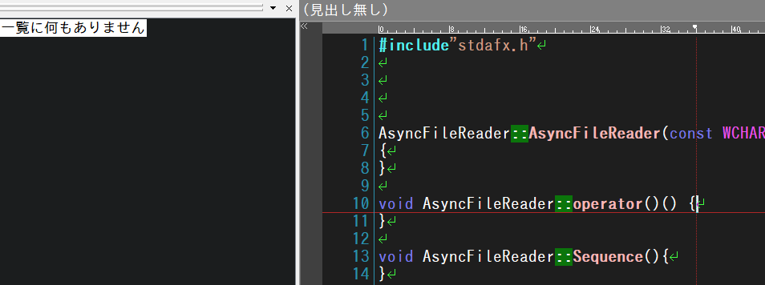
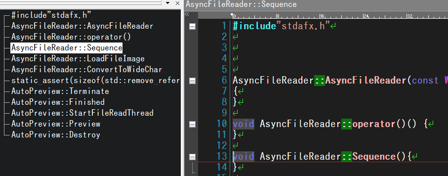
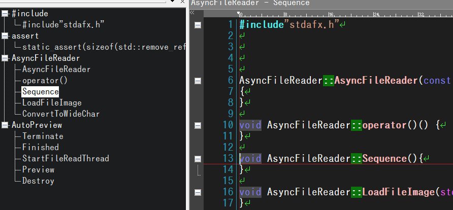

# ファイルの説明

|ファイル名|説明|
|--|--|
|target.cpp|テスト用の定義|
|c.hilight|アウトライン定義|
|test.mac|テストマクロ|


# 再現手順

- アウトライン定義を秀丸エディタに反映します。
- target.cppを秀丸エディタで開きtest.macを実行します
- 実行結果が新しい秀丸エディタに表示されます。


# アウトラインの表示と問題点


## 関数一覧



```
インデントの深さ	行番号	アウトライン
-1	6	AsyncFileReader::AsyncFileReader(const WCHAR *filename, size_t request_read_byte)
-1	10	AsyncFileReader::operator()()
-1	13	AsyncFileReader::Sequence()
-1	16	AsyncFileReader::LoadFileImage(std::vector<uint8_t>&out_fileimage)
-1	19	AsyncFileReader::ConvertToWideChar(std::wstring&out, const std::vector<uint8_t>&fileimage)
-1	24	AutoPreview::Terminate()
-1	27	AutoPreview::Finished()
-1	30	AutoPreview::StartFileReadThread()
-1	33	AutoPreview::Preview()
-1	36	AutoPreview::Destroy()
```

インデントの深さが-1です。-1とは一体・・・


## 強調一覧



```
インデントの深さ	行番号	アウトライン
-1	1	一覧に何もありません
```

インデントの深さが-1です。-1とは一体・・・


## ツリー表示 - 通常



```
インデントの深さ	行番号	アウトライン
0	1	#include"stdafx.h"
0	6	AsyncFileReader::AsyncFileReader
0	10	AsyncFileReader::operator()
0	13	AsyncFileReader::Sequence
0	16	AsyncFileReader::LoadFileImage
0	19	AsyncFileReader::ConvertToWideChar
0	20			static_assert(sizeof(std::remove_reference< decltype(out.at(0))>::type) == sizeof(unsigned short), "sizeof(wchar_t) != sizeof(unsigned) short. Must change _byteswap_ushort function.");
0	24	AutoPreview::Terminate
0	27	AutoPreview::Finished
0	30	AutoPreview::StartFileReadThread
0	33	AutoPreview::Preview
0	36	AutoPreview::Destroy
```

static_assertだけ結果が間違っています。（何故か空白が多いです）

```
（誤）0	20			static_assert(省略
（正）0	20	static_assert(省略
```

## ツリー表示 - 分類




```
インデントの深さ	行番号	アウトライン
0	1	#include
1	6	#include"stdafx.h"
0	10	assert
1	13	assert(sizeof(std::remove_reference< decltype(out.at(0))>::type) == sizeof(unsigned short), "sizeof(wchar_t) != sizeof(unsigned) short. Must change _byteswap_ushort function.");
0	16	AsyncFileReader
1	19	AsyncFileReader(const WCHAR *filename, size_t request_read_byte)
1	20	operator()() {
1	24	Sequence(){
1	27	LoadFileImage(std::vector<uint8_t>&out_fileimage) {
1	30	ConvertToWideChar(std::wstring&out, const std::vector<uint8_t>&fileimage) {
0	33	AutoPreview
1	36	Terminate()  {
```

### （問題　その1）
アウトライン中の以下定義をマクロで取得できていません。

- Finished
- StartFileReadThread
- Preview
- Destroy

### （問題　その2）

アウトラインと異なる箇所があります。

```
（誤）1    27    LoadFileImage(std::vector<uint8_t>&out_fileimage) {
（正）1    27    LoadFileImage
```

以上です